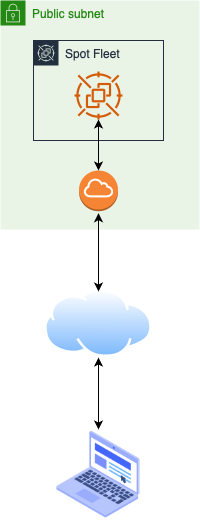

# Kind on spot-instance

Used to spawn simple spot VM with kind and all the necessary stuff to work from your home host securely.

IMPORTANT: Do not use this on public and untrusted subnet as it would authorize "your" public to access the environment.

NOTE: This has only be tested on MacOS but should work on linux and windows, maybe with some adaptations.

## Schemas

## Prerequisites

You will need to install terraform to create the VM and all the stuff :

[source,bash]
brew install terraform screen sshuttle kubernetes-cli

link:https://github.com/sshuttle/sshuttle[Sshuttle] is use to expose the k8s networks to your local machine.

You should also have a public subnet (meaning with an Internet Gateway) already created and its id.

## How it works

The terraform will :

- Create a S3 bucket, create a package with the kind lib and put it into the bucket for deployment ;
- Create a spot instance using debian 11 and paramaters used ;
- Deploy and run a userdata that will create a kind environment called `mgmt` ;
- Outputs commands to run to be able to use the environment directly from your host (security is a IP filter on your public IP, don't use this on wifi or network you don't trust).

## How to use

- Create your `environment.tfvars` from the example

- Create the instance

[source,bash]
terraform apply -var-file="environment.tfvars"

- Add the kind cluster to your kube config or use the `--kubeconfig` option (see terraform outputs for commands)

### How to delete the instance

[source,bash]
terraform destroy -target=aws_spot_fleet_request.spot_instance -var-file="environment.tfvars"

### How to show outputs

[source,bash]
terraform apply -target=output.spot_public_ip -var-file="environment.tfvars"
